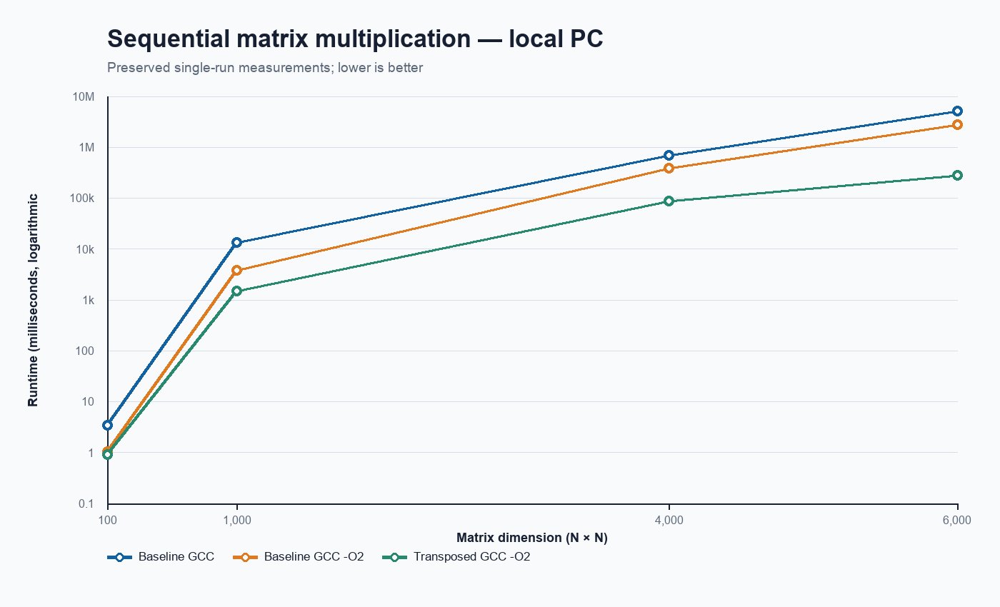
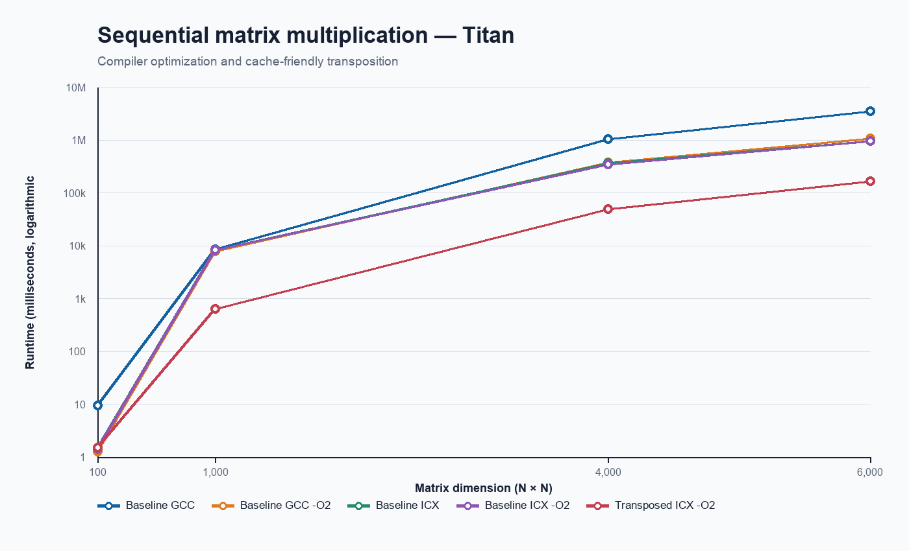
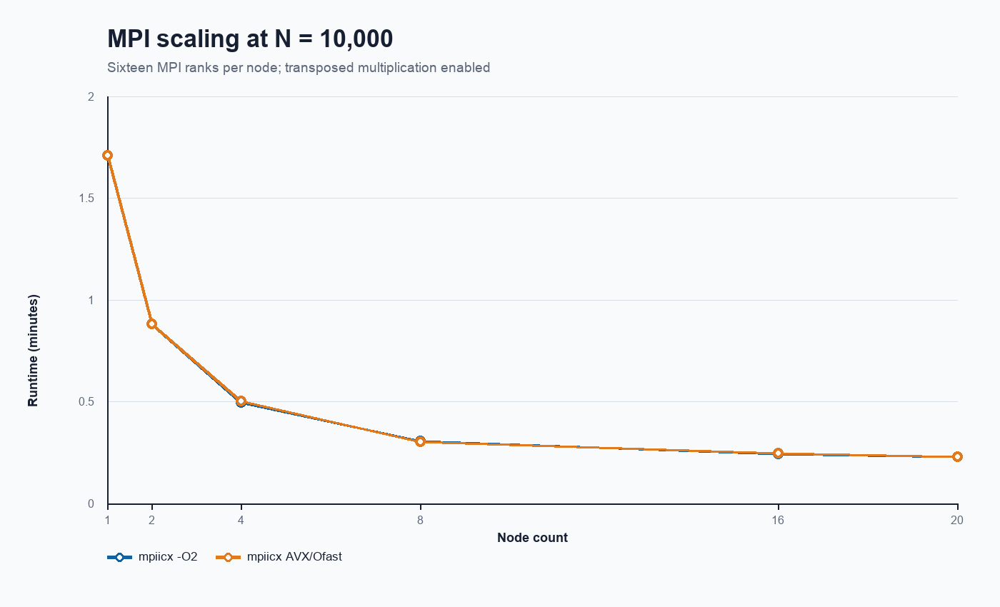
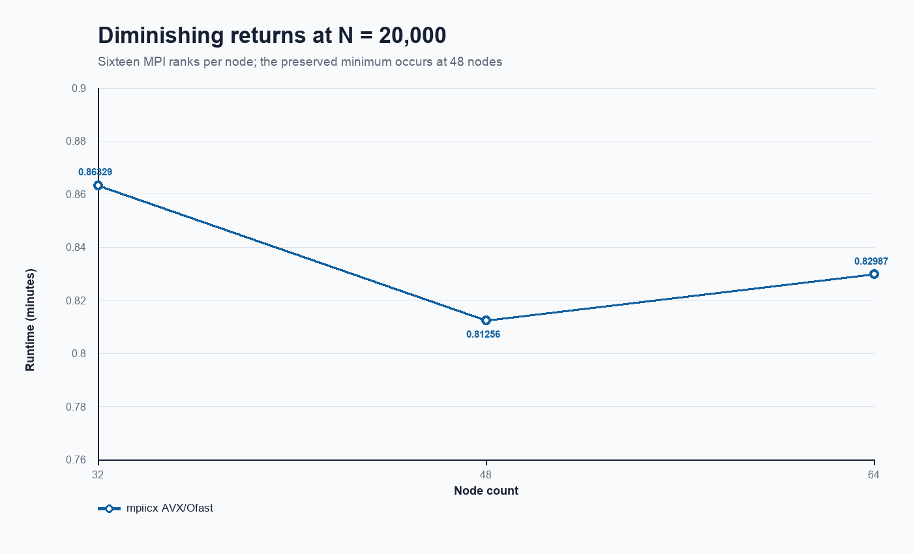

# MPI Matrix Multiplication Scalability Study

This repository reconstructs a collaborative CSC 462 high-performance computing project by **Inioluwa Eboda and Suwilanji Mwanza**. The study progresses from sequential matrix multiplication to compiler optimization, cache-friendly transposition, and distributed-memory parallelism with MPI.

The portfolio edition preserves the original benchmark measurements while separating them from later documentation, code repair, and repository curation. The reconstructed MPI implementation is not claimed to reproduce the historical timings.

## Study scope

- Baseline sequential matrix multiplication using a three-loop algorithm.
- GCC and Intel compiler comparisons, including `-O2` optimization.
- Cache-friendly multiplication using a transposed right-hand matrix and contiguous dot products.
- Row-wise distribution of matrix A across MPI ranks.
- Broadcast of matrix B to every rank.
- Strong-scaling experiments across multiple nodes and MPI ranks.
- Analysis of diminishing returns at higher node counts.

## Implementations

| File | Purpose | Historical basis |
| --- | --- | --- |
| `src/matrix_serial.c` | Baseline sequential implementation | Final packaged `mm.c` |
| `src/matrix_transposed.c` | Sequential transpose and dot-product implementation | Working `mm2I.c` |
| `src/matrix_mpi.c` | Repaired distributed-memory implementation | Final packaged `mmmpi.c`, checked against earlier and later preserved versions |

The MPI source contains explicit `PORTFOLIO REPAIR` comments. [The repair record](docs/repairs.md) describes every functional difference from the final archived `mmmpi.c`.

## Repository layout

```text
.
├── README.md
├── docs/
│   ├── provenance.md
│   └── repairs.md
├── results/
│   ├── README.md
│   ├── benchmarks.csv
│   └── charts/
├── scripts/
│   └── plot_benchmarks.py
├── src/
│   ├── matrix_mpi.c
│   ├── matrix_serial.c
│   └── matrix_transposed.c
├── .gitignore
└── requirements.txt
```

## Building

The sequential versions require a C11 compiler on a POSIX-compatible system. They use the POSIX `clock_gettime` function for timing:

```bash
cc -std=c11 -O2 -Wall -Wextra -pedantic src/matrix_serial.c -o matrix_serial
cc -std=c11 -O2 -Wall -Wextra -pedantic src/matrix_transposed.c -o matrix_transposed
```

Each historical sequential program automatically runs the complete matrix-size sequence—100, 1,000, 4,000, and 6,000—when launched. The 6,000 × 6,000 cases require substantial memory and computation time.

The distributed version additionally requires an MPI implementation and compiler wrapper. It uses the POSIX `clock_gettime` and `gethostname` functions:

```bash
mpicc -std=c11 -O2 -Wall -Wextra -pedantic src/matrix_mpi.c -o matrix_mpi
mpirun -np 4 ./matrix_mpi 1000 1
```

The MPI arguments are the square matrix dimension followed by `0` for the baseline multiplication kernel or `1` for the transposed kernel.

## Local validation

In 2026, the reconstructed MPI implementation was compiled with strict warning flags and functionally tested on an Apple Silicon Mac using Open MPI 5.0.9. Successful tests covered:

- Single-rank and multi-rank execution.
- Transpose disabled and enabled.
- Uneven and evenly divided row distributions.
- Cases where some MPI ranks received zero rows.
- Invalid matrix-size and transpose-flag handling.
- UndefinedBehaviorSanitizer testing across representative single-rank and multi-rank cases.

All of these functional tests passed, including the program's built-in correctness check. AddressSanitizer execution stalled in the local Open MPI runtime before program output and produced no sanitizer defect report, so ASan validation remains inconclusive.

These tests establish local functional validation of the 2026 portfolio reconstruction. They do not reproduce or independently validate the historical multi-node performance measurements obtained during the original CSC 462 project on Oral Roberts University's Titan HPC cluster.

## Historical benchmark results

The normalized dataset is in [`results/benchmarks.csv`](results/benchmarks.csv). It contains the preserved values without interpolation, averaging, or unit conversion. Fields distinguish compiler flags, matrix size, node count, ranks per node, total ranks, transpose status, runtime, and runtime unit.

Titan is the high-performance computing (HPC) cluster at Oral Roberts University. It was the multi-node computing environment used for the large-scale MPI experiments and performance benchmarks in this project.

### Sequential and cache-friendly performance





The transposed implementation produced its largest advantage on the larger matrices. On the Titan HPC cluster at matrix size 6,000, the recorded `mm2` ICX `-O2` time was 168,600.517 ms, compared with 968,494.077 ms for the baseline ICX `-O2` run.

### MPI scaling at matrix size 10,000




With one MPI rank per node, the recorded `-O2` runtime decreased from 12.33209 minutes on one node to 0.66259 minutes on 20 nodes. With 16 ranks per node, runtime continued to fall, but the marginal improvement diminished at higher node counts. Communication and coordination overhead are plausible contributors, but the preserved measurements do not isolate or directly measure those costs.

### Diminishing returns at matrix size 20,000



The best preserved time for the 20,000 matrix was 0.81256 minutes on 48 nodes and 768 MPI ranks. Increasing to 64 nodes and 1,024 ranks increased runtime to 0.82987 minutes.

Regenerate all charts from the CSV with:

```bash
python3 -m pip install -r requirements.txt
python3 scripts/plot_benchmarks.py
```

## Benchmark methodology limitations

- The preserved workbook contains single recorded values rather than repeated trials. No variance, confidence interval, or measurement uncertainty can be calculated from the available data.
- Raw scheduler output and cluster job logs are unavailable.
- The exact source revision used to produce the recorded MPI measurements was not preserved.
- The original materials sometimes use “threads” where “MPI ranks” or “MPI processes” is more accurate. The normalized CSV uses MPI terminology and documents how ambiguous workbook fields were interpreted.
- The original job script is unavailable, so scheduler directives, process placement, affinity, and environment-module details cannot yet be reproduced.
- The hardware and software environment has not been reconstructed in sufficient detail to compare new runs directly with the historical measurements.
- The historical sequential programs do not validate or consume the result matrix after timing. A checksum or correctness check would strengthen future testing, but none has been added because it could change the historical benchmark behavior.

## Attribution

The original coursework, implementations, measurements, report, and presentation were developed collaboratively by **Inioluwa Eboda and Suwilanji Mwanza**. Subsequent portfolio curation and engineering repairs are documented in [`docs/provenance.md`](docs/provenance.md) and [`docs/repairs.md`](docs/repairs.md).

No license has been selected for this portfolio reconstruction. A license and contributor approval should be confirmed before public release.
